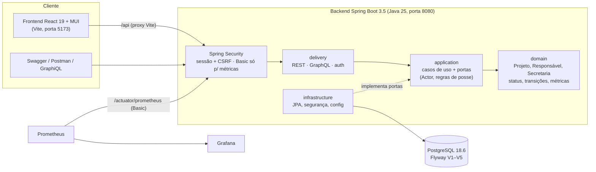

# Facilit — Desafio Técnico Kanban

API Java para gestão de projetos em quadro Kanban, feita para o Desafio Técnico Backend (Back-End Sênior) da Facilit. O REST é o contrato obrigatório; GraphQL, interface web, autenticação do responsável, observabilidade e CI entram como diferenciais sobre os mesmos casos de uso.

## Sumário

- [Visão geral](#visão-geral)
- [Arquitetura e decisões técnicas](#arquitetura-e-decisões-técnicas)
- [Regras de negócio](#regras-de-negócio)
- [Como rodar (Docker)](#como-rodar-docker)
- [Como testar](#como-testar)
- [API: Swagger, GraphQL e erros](#api-swagger-graphql-e-erros)
- [Segurança](#segurança)
- [Observabilidade](#observabilidade)
- [CI (GitHub Actions)](#ci-github-actions)
- [Estrutura de pastas e convenções](#estrutura-de-pastas-e-convenções)
- [Uso de IA](#uso-de-ia)
- [Limitações e próximos passos](#limitações-e-próximos-passos)
- [Governança e histórico de entrega](#governança-e-histórico-de-entrega)

## Visão geral

| Item do desafio | Onde está |
|---|---|
| CRUD de Projeto e Responsável (e-mail único) com Swagger | REST `/api/v1/projects`, `/api/v1/responsibles`; `/swagger-ui.html` e `/api-docs` |
| Status calculado, dias de atraso e % de tempo restante | domínio puro: `ProjectScheduleCalculator` |
| Quadro Kanban e transições da tabela, com bloqueio e mensagem clara | `ProjectStatusTransition` + `PATCH /api/v1/projects/{id}/status` |
| Indicadores (contagem e média de atraso por status) | `GET /api/v1/indicators/projects` e GraphQL `projectIndicators` |
| Testes JUnit de services, controllers e integração | `backend/src/test` (unitários + ITs com Testcontainers/PostgreSQL) |
| Docker Compose (app + banco) | `compose.yaml` |
| `AI_USAGE.md` | [`AI_USAGE.md`](AI_USAGE.md) |
| Diferencial — GraphQL | `/graphql` (mesmos casos de uso do REST) |
| Diferencial — UI Kanban com drag-and-drop | `frontend/` (React 19 + MUI) |
| Diferencial — CRUD de Secretaria e filtros avançados | `/api/v1/secretariats`; filtros por status, secretaria, responsável, período e texto |
| Diferencial — autenticação do responsável | perfil `RESPONSIBLE` (altera só os próprios projetos) |
| Diferencial — observabilidade | Actuator, Prometheus, Grafana e logs JSON (ECS) |
| Diferencial — CI/CD | `.github/workflows/ci.yml` |
| Diferencial — camada de IA (Etapa 5) | ADR [`docs/adr/0001-camada-ia-agente-rag.md`](docs/adr/0001-camada-ia-agente-rag.md) |

## Arquitetura e decisões técnicas



- **Clean Architecture pragmática.** O domínio não conhece Spring, banco nem HTTP; a aplicação expõe casos de uso e portas, montados em `ApplicationBeans` (composition root). REST e GraphQL chamam os mesmos serviços, sem regra duplicada; controllers e resolvers ficam finos.
- **Regra de negócio determinística no domínio.** Status, dias de atraso e % de tempo restante são calculados por `ProjectScheduleCalculator` a partir da data de hoje obtida de um `Clock` UTC injetado no `ProjectService`; as transições aplicam só os efeitos da tabela do desafio e recalculam o status, bloqueando quando o resultado difere do pedido.
- **Persistência.** PostgreSQL com Flyway (schema versionado e `ddl-auto: validate`), índices alinhados às consultas paginadas e filtros via JPA `Specification`.
- **Contrato de erro estável.** `ProblemDetail` (RFC 9457) com `code` fixo no REST e `extensions.code` no GraphQL.
- **Segurança por padrão.** Sessão HTTP com CSRF para SPA, senhas bcrypt, sem credencial padrão versionada, autorização de posse na camada de aplicação.
- **Versões congeladas.** Java 25, Spring Boot 3.5.16, PostgreSQL 18.6, React 19.3, MUI 9.4, TanStack Query 5.102, TypeScript 5.9, Vite 8.3, Vitest 4.1, Biome 2.5, pnpm 12.5.1, Node 24.

As decisões de cada lote, com fonte e marcação de verificação, estão em `docs/evidence/<LOTE>/DECISOES.md`.

## Regras de negócio

- **Status**: A iniciar (sem início e término realizados), Em andamento (início realizado, término previsto futuro, sem término realizado), Atrasado (início previsto vencido sem início realizado, ou término previsto vencido sem término realizado) e Concluído (término realizado preenchido). Editar datas recalcula o status.
- **Transições**: seguem a tabela do desafio linha a linha (efeito automático, recálculo e bloqueio com mensagem quando o status final diverge do solicitado). Erros de transição respondem 400 `INVALID_REQUEST` com a orientação do desafio.
- **Métricas**: dias de atraso e % de tempo restante conforme as fórmulas do desafio, com os casos de zero previstos (sem datas, concluído, prazo vencido).
- **Responsável**: e-mail único (sem diferenciar maiúsculas); não pode ser removido enquanto estiver em projeto (409). **Secretaria**: não pode ser removida enquanto tiver responsável (409).

## Como rodar (Docker)

Pré-requisitos: Docker com Compose v2. Para rodar fora do Docker: JDK 25 + Maven 3.9 e Node 24 + pnpm 12.5.1 (via corepack).

1. Prepare o `.env` (ignorado pelo Git). Não há credencial padrão: defina `POSTGRES_PASSWORD`, `APP_ADMIN_EMAIL` e `APP_ADMIN_PASSWORD`. O administrador é criado na primeira subida e a senha fica só como hash bcrypt.

   ```bash
   cp .env.example .env
   # edite .env: POSTGRES_PASSWORD, APP_ADMIN_EMAIL, APP_ADMIN_PASSWORD
   # opcional (responsável de demonstração, os quatro juntos, senha ≥ 12 caracteres):
   # APP_DEMO_RESPONSIBLE_NAME, _EMAIL, _POSITION, _PASSWORD
   ```

2. Suba banco, backend e frontend:

   ```bash
   docker compose up --build -d
   ```

Serviços:

- frontend: `http://localhost:5173`
- Swagger UI: `http://localhost:8080/swagger-ui.html` · OpenAPI: `http://localhost:8080/api-docs`
- GraphQL: `http://localhost:8080/graphql` (autenticado) · GraphiQL: `http://localhost:8080/graphiql`
- REST health: `http://localhost:8080/api/v1/health`
- autenticação: `GET /api/v1/auth/csrf`, `POST /api/v1/auth/login`, `GET /api/v1/auth/me`, `POST /api/v1/auth/logout`
- health do Actuator: `http://localhost:8080/actuator/health` (público, sem detalhes; também `/liveness` e `/readiness`)
- métricas Prometheus: `http://localhost:8080/actuator/prometheus` (HTTP Basic com a credencial técnica de métricas)
- PostgreSQL: só na rede interna do Compose (`db:5432`)

### Observabilidade (opcional)

Preencha `METRICS_PASSWORD` e `GRAFANA_ADMIN_PASSWORD` no `.env` (mínimo de 16 caracteres para `METRICS_PASSWORD`; gere com `python3 -c 'import secrets; print(secrets.token_urlsafe(32))'`) e suba com a sobreposição:

```bash
docker compose -f compose.yaml -f compose.observability.yaml up --build -d
```

- Prometheus: `http://127.0.0.1:9090` (coleta `backend:8080/actuator/prometheus` a cada 15 s);
- Grafana: `http://127.0.0.1:3000`, usuário `admin` e a senha de `GRAFANA_ADMIN_PASSWORD`; painel provisionado **Facilit Kanban — Backend**. A senha do Grafana vale na criação do contêiner; para trocá-la, recrie o serviço (`docker compose -f compose.yaml -f compose.observability.yaml up -d --force-recreate grafana`).

## Como testar

Backend (unitários com Surefire; integração com Failsafe + Testcontainers, exige Docker):

```bash
cd backend
mvn -B -ntp clean verify
```

Frontend:

```bash
cd frontend
corepack enable
corepack prepare pnpm@12.5.1 --activate
pnpm install --frozen-lockfile
pnpm lint          # Biome
pnpm typecheck     # TypeScript strict
pnpm check:strict  # proíbe any, asserção `as` e non-null `!` em src/
pnpm test          # Vitest + Testing Library
pnpm build
```

Coleção de API ([`docs/api/facilit-kanban.postman_collection.json`](docs/api/facilit-kanban.postman_collection.json), importável no Postman e no Insomnia): percorre autenticação com CSRF, cadastros, transição legítima e bloqueada, filtros, indicadores, GraphQL, erros 401/400/409 e limpeza. Com o backend no ar, informe `adminEmail` e `adminPassword` num ambiente e execute as pastas na ordem. Os mesmos 21 cenários rodam por `curl` no gate de entrega (`docs/evidence/F3-L4/VERIFICACAO-USUARIO.md`).

## API: Swagger, GraphQL e erros

- OpenAPI com exemplos e schemas em `/api-docs`; Swagger UI em `/swagger-ui.html`.
- GraphQL (`backend/src/main/resources/graphql/*.graphqls`) espelha o REST: consultas de projetos com os mesmos filtros, indicadores, CRUD e transição.
- Erros REST em `ProblemDetail` com `code` estável: `VALIDATION_ERROR` e `INVALID_REQUEST` (400), `UNAUTHORIZED` (401), `FORBIDDEN` (403), `RESOURCE_NOT_FOUND` (404), `CONFLICT` (409) e `INTERNAL_ERROR` (500, com `incidentId` e sem detalhe interno). No GraphQL, o mesmo código vai em `extensions.code`.
- Paginação por `page`/`size` em todas as listagens.

## Segurança

- Login por e-mail e senha, sessão em cookie `HttpOnly`/`SameSite=Lax` e CSRF para SPA (`XSRF-TOKEN` + cabeçalho `X-XSRF-TOKEN`). Senhas com `DelegatingPasswordEncoder`/bcrypt.
- Perfis: `ADMIN` (tudo) e `RESPONSIBLE` (vê o quadro inteiro; cria, edita, transiciona e exclui só os projetos em que é responsável). Responsáveis, secretarias e credenciais só com o ADMIN. O ADMIN define ou revoga a senha de um responsável em `PUT`/`DELETE /api/v1/responsibles/{id}/credentials` (mínimo de 12 caracteres, máximo de 72 bytes).
- Negar por padrão: caminhos fora das regras explícitas são negados; erros inesperados sem stack trace; endpoints do Actuator além de `health` e `prometheus` indisponíveis.
- Nenhuma credencial versionada: administrador, responsável de demonstração e senhas de observabilidade vêm do `.env`.

## Observabilidade

- Actuator expõe só `health` (público, sem detalhes) e `prometheus` (HTTP Basic com a credencial técnica `ROLE_METRICS`, cadeia stateless própria; sessão, ADMIN e responsável não leem métricas; sem senha configurada o endpoint fica fechado).
- Métricas com a tag `application="facilit-kanban"`: histograma de `http.server.requests` (p95), JVM e pool HikariCP.
- Logs JSON no formato ECS (`@timestamp`, `log.level`, `message`, `ecs.version`) no Docker Compose; execução local via Maven mantém o log legível.
- `compose.observability.yaml` adiciona Prometheus v3.14.0 e Grafana 13.1.3 ligados só em `127.0.0.1`, com datasource e painel provisionados em `observability/`.

## CI (GitHub Actions)

`.github/workflows/ci.yml` roda em `push`, `pull_request` e manualmente, com três jobs:

- `frontend`: Node 24, pnpm 12.5.1, `pnpm install --frozen-lockfile`, lint, typecheck, `check:strict`, testes e build;
- `backend`: JDK 25 (Temurin) com cache Maven, `mvn -B -ntp clean verify` (compilação com `-Xlint:all -Werror`, unitários e integração com Testcontainers);
- `repository`: `git diff --check` sobre a árvore inteira, ausência de `localStorage`/`sessionStorage` no frontend e de `.env`/chaves versionados.

Práticas de segurança do workflow: `permissions: contents: read`, actions fixadas por SHA completo, `persist-credentials: false`, sem `pull_request_target`, sem runner próprio e sem segredos.

## Estrutura de pastas e convenções

```text
backend/                     API Spring Boot (Maven)
  src/main/java/br/com/facilit/kanban/
    domain/                  entidades e regras puras (projeto, responsável, secretaria)
    application/             casos de uso, portas e erros de aplicação (Actor, Conflict, NotFound, Forbidden)
    infrastructure/          JPA, segurança (sessão, CSRF, Actuator), configuração
    delivery/                REST, GraphQL e autenticação
  src/main/resources/        application.yml, db/migration (Flyway V1–V5), graphql/*.graphqls
  src/test/java/             unitários (domínio, serviços, controllers) e integração (*IT, Testcontainers)
frontend/                    React 19 + MUI + TanStack Query (Vite)
  src/api/                   cliente HTTP e contratos, independente do React Query
  src/features/              auth, dashboard, kanban, indicators, secretariats
  src/app, components, pages navegação, estados visuais compartilhados e página 404
  scripts/                   verificação de tipagem estrita
observability/               configuração do Prometheus e provisionamento do Grafana
docs/api/                    coleção Postman/Insomnia
docs/adr/                    decisões de arquitetura (camada de IA)
docs/governance/             prompts executivos e replanejamento que governam a entrega
docs/evidence/<LOTE>/        pacote de evidências e gate de cada lote
.github/workflows/           CI
```

Convenções: código e identificadores em inglês, documentação em português; testes de integração com sufixo `IT`; migrations `V<n>__descricao.sql` sem edição após aplicadas; frontend sem `any`, `as` ou `!` e sem credencial no navegador; cada lote fecha com gate executado (`docs/evidence/<LOTE>/VERIFICACAO-USUARIO.md`).

## Uso de IA

O uso de IA no desenvolvimento está descrito em [`AI_USAGE.md`](AI_USAGE.md). A proposta de camada de IA do produto (Etapa 5) está no ADR [`docs/adr/0001-camada-ia-agente-rag.md`](docs/adr/0001-camada-ia-agente-rag.md), sem implementação.

## Limitações e próximos passos

- A camada de IA (agente/RAG) está só especificada em ADR.
- Sem tela de gestão de credenciais no frontend; o ADMIN usa REST/Swagger ou GraphQL.
- Busca textual por substring sem índice dedicado (`pg_trgm` seria o próximo passo para volume maior).
- Sessão em memória do processo: escalar horizontalmente exigiria sessão compartilhada (por exemplo, Spring Session com Redis ou JDBC).
- Observabilidade sem tracing distribuído e sem regras de alerta.
- Bundle do frontend acima de 500 kB (aviso não bloqueante do Vite); divisão de código é o próximo passo.
- Execução dos testes de integração depende de Docker disponível (Testcontainers).

## Governança e histórico de entrega

Governança em `docs/governance`: `PROMPT-EXECUTIVO-BASE-v1.1.md`, `PROMPT-EXECUTIVO-KANBAN-v1.0.md` e `REPLANEJAMENTO-F3.md`. Cada lote gera o Pacote Anti-Alucinação (livro-razão, fontes, decisões, consumidores, matriz requisito → implementação → teste → evidência, riscos e gate) em `docs/evidence/<LOTE>/`.

Estado dos lotes:

- F0-L1 — Bootstrap: GREEN em 2026-09-21.
- F0-L2 — Domínio: GREEN em 2026-09-21.
- F0-L3 — Motor de regras: GREEN em 2026-09-21.
- F0 — Fundação + domínio: GREEN em 2026-09-21.
- F1-L1 — CRUD REST + GraphQL: GREEN em 2026-09-22.
- F1-L2 — Kanban e transições: GREEN em 2026-09-22.
- F1-L3 — API e qualidade: GREEN em 2026-09-22.
- F1 — Backend funcional: GREEN em 2026-09-22.
- F2-L1 — Segurança: GREEN em 2026-09-22.
- F2-L2 — Fundação frontend autenticada: GREEN em 2026-09-22.
- F2-L3 — Kanban UI: GREEN em 2026-09-22.
- F2 — Segurança + UI: GREEN em 2026-09-22.
- F3-L1 — Funcionalidades diferenciais: GREEN em 2026-09-23.
- F3-L2 — Autenticação do responsável + erro seguro: GREEN em 2026-09-23.
- F3-L3 — Observabilidade: GREEN em 2026-09-23.
- F3-L4 — Engenharia de entrega: CANDIDATE em 2026-09-23, aguardando gate local e primeiro pipeline no GitHub.

### Resumo por lote

### F1-L1 — CRUD

O F1-L1 adiciona CRUD paginado de Projeto e Responsável sobre os mesmos casos de uso para REST e GraphQL, persistência JPA sobre o schema Flyway existente, auditoria de criação/atualização, normalização e unicidade de e-mail e proteção contra remoção de responsável ainda associado a projeto. O contrato padronizado definitivo de erros permanece para F1-L3; neste lote existe apenas o mapeamento HTTP/GraphQL mínimo necessário para o CRUD.

### F1-L2 — Kanban e transições

O F1-L2 adiciona filtro paginado por status em REST/GraphQL e uma política de transição de domínio que aplica exclusivamente as ações automáticas da tabela, recalcula status/métricas e bloqueia qualquer resultado incompatível com o status solicitado. REST e GraphQL reutilizam `ProjectService.transition`.

### F1-L3 — API e qualidade

O F1-L3 padroniza erros REST/GraphQL com códigos estáveis, reforça Bean Validation nas duas fronteiras, publica OpenAPI/Swagger, adiciona índices alinhados às consultas paginadas reais e introduz integração/API tests com PostgreSQL 18.6 descartável via Testcontainers. O gate local foi concluído com exit code 0 e promoveu F1-L3/F1 para GREEN.

### F2-L1 — Segurança

O F2-L1 adiciona Spring Security com autenticação por e-mail/senha, conta administrativa persistida no PostgreSQL, senha armazenada somente por `DelegatingPasswordEncoder`/bcrypt, sessão HTTP com cookie `HttpOnly`/`SameSite=Lax`, autorização `ROLE_ADMIN`, CSRF compatível com SPA por cookie `XSRF-TOKEN`, login/logout, respostas 401/403 sem detalhes sensíveis e testes de integração específicos. REST de health e documentação permanecem públicos; os endpoints de negócio REST e `/graphql` exigem autenticação.

### F2-L2 — Fundação frontend autenticada

O F2-L2 conecta o frontend ao contrato de autenticação já validado no F2-L1. A aplicação passa a ter rota de login e área protegida, sessão validada por `GET /api/v1/auth/me`, login/logout com CSRF obtido do backend, estados explícitos de carregamento e erro e uma estrutura visual Material UI consistente para o painel. O estado remoto de autenticação permanece em React Query; nenhuma credencial é persistida em `localStorage` ou `sessionStorage`.

O roteamento deste lote cobre somente `/login` e `/` usando a History API nativa do navegador. Essa escolha evita dependência adicional para duas rotas e mantém o diff mínimo; a decisão deve ser reavaliada apenas se a navegação do F2-L3 exigir uma árvore de rotas maior.

### F2-L3 — Kanban UI

O F2-L3 adiciona o quadro Kanban autenticado com as quatro colunas do domínio (`NOT_STARTED`, `IN_PROGRESS`, `OVERDUE`, `COMPLETED`), drag-and-drop nativo, criação/edição/exclusão de projetos, cadastro de responsável, associação de responsáveis, feedback das mensagens de domínio e atualização do estado remoto via React Query. As mutações reutilizam o mesmo contrato CSRF validado no F2-L2.

A UI foi reorganizada por responsabilidade: `App.tsx` atua somente como composition root de navegação; autenticação fica em `features/auth`, painel em `features/dashboard`, Kanban em `features/kanban`, navegação em `app/navigation.ts` e estados visuais compartilhados em `components`. O quadro mantém a orquestração de queries/mutações enquanto coluna e diálogos permanecem componentes focados. A camada `api` continua independente do React Query; os callbacks do framework usam adaptadores explícitos.

### F3-L1 — Funcionalidades diferenciais

O F3-L1 adiciona indicadores de projetos, incluindo quantidade por status, média de dias de atraso por status, total e quantidade com atraso; CRUD de Secretaria em REST e GraphQL; e filtros avançados de projetos por status, secretaria, responsável, interseção do período previsto e texto. REST e GraphQL reutilizam o mesmo `ProjectService` e o mesmo `ProjectFilter`.

No frontend, indicadores, gerenciamento de secretarias e filtros ficam em features focadas. O quadro continua responsável pela orquestração do Kanban e invalida indicadores quando mutações de projeto alteram a carteira. Os filtros relacionais e temporais usam os índices já existentes da migration V1/V3; a busca textual por substring permanece sem extensão PostgreSQL adicional para manter o diferencial de baixo risco.

### F3-L2 — Autenticação do responsável + erro seguro

O F3-L2 adiciona o perfil `RESPONSIBLE` ao lado do `ADMIN`, conforme o `docs/governance/REPLANEJAMENTO-F3.md`:

- o ADMIN define ou revoga a senha de um responsável em `PUT`/`DELETE /api/v1/responsibles/{id}/credentials` ou pelas mutations GraphQL `setResponsibleCredentials`/`revokeResponsibleCredentials`; a senha exige no mínimo 12 caracteres e no máximo 72 bytes;
- o responsável entra pelo mesmo `POST /api/v1/auth/login`; `GET /api/v1/auth/me` passa a informar `responsibleId`;
- o responsável vê o quadro inteiro, os indicadores, os responsáveis e as secretarias, e cria, edita, transiciona e exclui apenas os projetos em que é responsável; responsáveis, secretarias e credenciais ficam só com o ADMIN;
- a regra de posse fica na camada de aplicação (`Actor` informado aos casos de uso), reutilizada por REST e GraphQL;
- o e-mail de login do responsável é copiado para `app_users` e sincronizado na mesma transação quando o ADMIN altera o e-mail do responsável; o índice único de login impede colisão com o e-mail do ADMIN (409);
- erros inesperados passam a responder 500 com `code = INTERNAL_ERROR` e `incidentId`, sem detalhes internos; rotas inexistentes respondem 404 em vez de 403.

### F3-L3 — Observabilidade

O F3-L3 adiciona observabilidade ao backend sem alterar regras de negócio:

- Spring Boot Actuator expõe somente `health` e `prometheus`; os demais endpoints ficam indisponíveis. `health` é público e responde só `UP`/`DOWN`, sem componentes nem detalhes;
- `/actuator/prometheus` usa uma cadeia de segurança própria, stateless, com HTTP Basic e a credencial técnica `ROLE_METRICS` (`APP_METRICS_USERNAME`, padrão `prometheus`, e `APP_METRICS_PASSWORD`). Sessão, ADMIN e responsável não leem métricas. Sem senha configurada, o endpoint fica fechado; senha abaixo de 16 caracteres ou acima de 72 bytes impede a subida;
- métricas com a tag `application="facilit-kanban"` e histograma de `http.server.requests` (latência p95), JVM e pool HikariCP;
- logs estruturados em JSON no formato ECS (`@timestamp`, `log.level`, `message`, `ecs.version`) no Docker Compose; a execução local via Maven mantém o log legível;
- `compose.observability.yaml` adiciona Prometheus v3.14.0 e Grafana 13.1.3, ligados só em `127.0.0.1`, com datasource e painel provisionados em `observability/`. A senha de métricas chega ao Prometheus como secret do Compose; nenhuma senha tem valor padrão.
