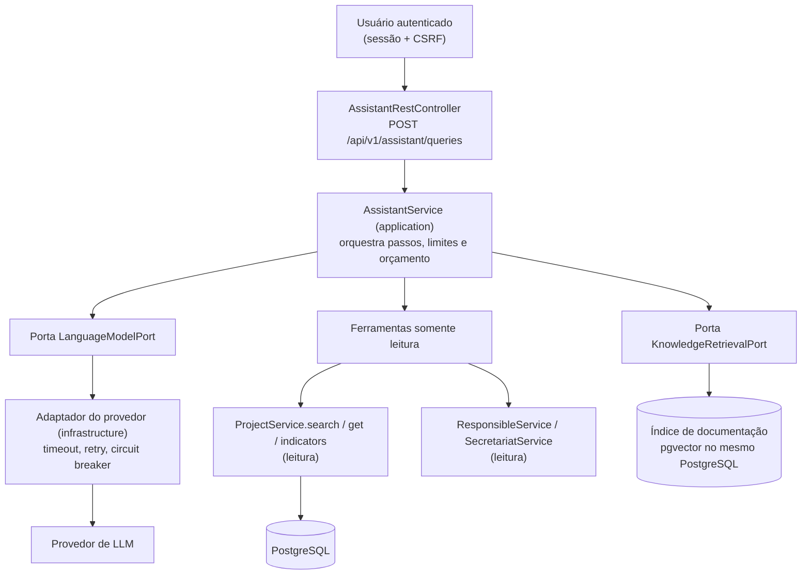

# ADR 0001 — Camada de IA: assistente de portfólio com agente e RAG

- **Status:** Proposto. Não implementado nesta entrega.
- **Data:** 2026-09-23
- **Contexto do desafio:** Etapa 5 (opcional): "ADR de agente/RAG ou SDD formal".
- **Escopo:** desenho da camada, contrato, montagem de contexto, falhas do provedor, trade-offs e limites. Nenhum código, dependência ou provedor foi adicionado.

## 1. Contexto

Gestores e responsáveis fazem perguntas que hoje exigem combinar filtros, indicadores e as regras do Kanban. Por exemplo:

- "Quais projetos da Secretaria de Saúde estão atrasados e o que falta para voltarem a andamento?"
- "Por que não consigo mover o projeto X para Em andamento?"

A API já tem as peças determinísticas:

- busca com filtros (`ProjectService.search`);
- indicadores (`ProjectService.indicators`);
- regras de status e transição no domínio;
- autorização por `Actor` na camada de aplicação.

Falta uma interface em linguagem natural que use essas peças sem recalcular regras nem enfraquecer a segurança.

Restrições que vêm da arquitetura atual:

1. O domínio e a aplicação não dependem de framework nem de provedor externo.
2. REST e GraphQL reutilizam os mesmos casos de uso.
3. A autorização de escrita já é aplicada pelos casos de uso, com o `Actor` da sessão; a leitura exige sessão autenticada.
4. Erros seguem `ProblemDetail` com `code` estável.

## 2. Decisão

Criar um **assistente somente leitura**. Ele combina dois mecanismos:

- **Agente com ferramentas**, para dados vivos. As ferramentas chamam os casos de uso de leitura existentes dentro da sessão autenticada do usuário. Status, atrasos e percentuais sempre vêm do domínio, nunca do modelo.
- **RAG sobre documentação**, para explicar regras. O índice cobre as regras de negócio do desafio, a tabela de transições, o README e os ADRs. A resposta cita os trechos usados.

O modelo de linguagem escolhe as ferramentas, redige a resposta e cita as fontes. Ele não decide status, não grava dados e não vê o que o usuário da sessão não pode ver.

### 2.1 Componentes



As portas `LanguageModelPort` e `KnowledgeRetrievalPort` ficam na camada de aplicação. Os adaptadores ficam em `infrastructure`. O provedor pode ser trocado sem tocar em domínio nem em casos de uso, e os testes usam dublês determinísticos.

### 2.2 Contrato proposto

**Requisição.** `POST /api/v1/assistant/queries` (autenticado, com CSRF):

```json
{
  "question": "Quais projetos da Secretaria de Saúde estão atrasados?",
  "conversationId": null
}
```

Validação da requisição:

- `question`: obrigatória, de 3 a 500 caracteres;
- `conversationId`: opcional, UUID.

**Resposta 200:**

```json
{
  "answer": "Há 2 projetos atrasados na Secretaria de Saúde: ...",
  "citations": [
    { "type": "PROJECT", "id": "5b0e...", "label": "Portal do Cidadão" },
    { "type": "DOCUMENT", "id": "regras-transicao#atrasado-em-andamento", "label": "Tabela de transições" }
  ],
  "toolCalls": [
    { "tool": "searchProjects", "arguments": { "status": "OVERDUE", "secretariatId": "..." }, "resultCount": 2 }
  ],
  "degraded": false,
  "conversationId": "0c1d...",
  "model": "<identificador do modelo configurado>",
  "usage": { "inputTokens": 1830, "outputTokens": 214, "latencyMs": 2140 }
}
```

Ferramentas expostas ao modelo. Todas são somente leitura. A identidade vem sempre da sessão, nunca de argumento gerado pelo modelo. Hoje ADMIN e RESPONSIBLE leem o quadro inteiro (decisão P2 do replanejamento), então os casos de uso de leitura não recebem `Actor`; se a regra de leitura mudar, o `Actor` passa a ser argumento do caso de uso, preenchido pelo servidor:

| Ferramenta | Caso de uso | Argumentos |
|---|---|---|
| `searchProjects` | `ProjectService.search` | status, secretariatId, responsibleId, plannedFrom, plannedTo, text, page, size (máx. 20) |
| `getProject` | `ProjectService.get` | id |
| `projectIndicators` | `ProjectService.indicators` | nenhum |
| `listSecretariats` / `listResponsibles` | serviços de leitura | page, size |
| `searchRules` | `KnowledgeRetrievalPort` | query (retorna até 5 trechos com id de citação) |

**Erros.** Seguem o contrato atual, com `ProblemDetail` e `code` estável:

| HTTP | `code` | Quando |
|---|---|---|
| 400 | `VALIDATION_ERROR` | pergunta vazia, longa demais ou `conversationId` inválido |
| 401 | `UNAUTHORIZED` | sem sessão |
| 403 | `FORBIDDEN` | CSRF ausente ou perfil sem acesso ao assistente |
| 429 | `RATE_LIMITED` | limite por usuário, por exemplo 10 perguntas por minuto |
| 503 | `AI_PROVIDER_UNAVAILABLE` | circuito aberto, ou falha do provedor sem resposta degradada possível |
| 504 | `AI_PROVIDER_TIMEOUT` | prazo total estourado sem resposta degradada possível |

No GraphQL, o equivalente é a query `askAssistant(question: String!, conversationId: ID): AssistantAnswer!`, com os mesmos códigos em `extensions.code`. Ela reutiliza o mesmo `AssistantService`.

### 2.3 Montagem de contexto

1. **Autorização primeiro.** A pergunta só é aceita com sessão válida e CSRF. O `Actor` vem da sessão (`AuthenticatedActorResolver`), e as ferramentas passam pelos mesmos casos de uso e regras de leitura da API.
2. **Mensagem de sistema fixa e versionada.** Ela define o papel do assistente, a proibição de inventar status, datas ou números, e a obrigação de citar ferramenta ou documento. Também manda responder "não sei" quando nenhuma fonte cobre a pergunta.
3. **Dados como dados.** Resultados de ferramentas e trechos de documento entram delimitados e marcados como conteúdo não confiável. Texto vindo do banco, como o nome de um projeto, nunca é tratado como instrução. Essa é a mitigação de injeção indireta de prompt.
4. **Minimização.** Só vão ao provedor os campos necessários: id, nome, status, datas, `delayDays`, `remainingTimePercentage`, nome da secretaria e nome do responsável. E-mails e credenciais não saem do backend.
5. **Orçamento.** O contexto tem limites:
   - no máximo 6 chamadas de ferramenta por pergunta;
   - no máximo 20 itens por chamada;
   - no máximo 5 trechos de RAG;
   - teto de tokens de entrada configurável;
   - histórico da conversa limitado às 4 últimas trocas, mantido no servidor com expiração.
6. **RAG.** Os documentos são fatiados por seção, com id estável (`arquivo#âncora`) e embeddings em `pgvector` no PostgreSQL existente, para não criar outro serviço. A busca é híbrida: vetor mais filtro por palavra-chave. Os documentos são reindexados a cada versão publicada.

### 2.4 Falhas, prazos e degradação

| Situação | Tratamento |
|---|---|
| Conexão com o provedor | timeout de conexão de 2 s |
| Resposta do provedor | timeout de leitura de 15 s por chamada; prazo total de 20 s por pergunta |
| 429 ou 5xx do provedor | 1 nova tentativa com backoff exponencial e jitter, respeitando `Retry-After`; nunca para 4xx de conteúdo |
| Falhas consecutivas | circuit breaker abre após 5 falhas em 30 s e fica meio-aberto após 60 s |
| Provedor indisponível ou prazo estourado | resposta degradada: executa só as ferramentas implícitas na pergunta, via filtros extraídos por regras simples, devolve os dados estruturados com `degraded: true` e sem texto gerado. Sem nenhum dado útil, responde 503 ou 504 |
| Resposta do modelo sem citação ou com número ausente das ferramentas | descartada e marcada `degraded: true` (validação pós-geração) |
| Ferramenta falha (erro de negócio) | o erro volta ao modelo como resultado da ferramenta, sem stack trace |

### 2.5 Observabilidade e custo

- Métricas Micrometer, que aparecem no Prometheus e no painel do Grafana já existentes:
  - `assistant.requests` por resultado (`ok`, `degraded`, `error`);
  - `assistant.latency` (histograma);
  - `assistant.tokens` (entrada e saída);
  - `assistant.tool.calls` por ferramenta;
  - estado do circuit breaker.
- Logs ECS registram id da pergunta, `Actor`, ferramentas chamadas, tokens e latência, sem o texto da pergunta nem da resposta, porque podem conter dados pessoais.
- Limite de taxa por usuário e teto diário de tokens por instalação.

## 3. Alternativas consideradas

| Alternativa | Por que não |
|---|---|
| RAG puro sobre um dump dos projetos | Os dados envelhecem a cada transição, e o modelo passaria a "calcular" status e atrasos. Violaria a regra de que o domínio é a única fonte do cálculo. |
| Text-to-SQL | Contornaria os casos de uso e a autorização, com risco de consulta indevida (por exemplo, a tabela de credenciais) e de injeção. |
| Agente com ferramentas de escrita (transicionar e editar) | Aumenta muito o impacto de um erro ou de uma injeção de prompt. Fica para depois, com confirmação explícita do usuário em duas etapas. |
| Banco vetorial dedicado | Operação extra sem ganho para um corpus pequeno. `pgvector` no PostgreSQL existente basta. |
| SDK de agente acoplado ao domínio | Quebraria a Clean Architecture. As portas na aplicação e os adaptadores na infraestrutura mantêm o provedor substituível. |

## 4. Consequências e trade-offs

- **A favor:**
  - números sempre corretos, porque vêm do domínio;
  - autorização reaproveitada;
  - provedor substituível;
  - testes determinísticos com dublê do modelo;
  - modo degradado útil.
- **Contra:**
  - latência de 2 a 5 s por pergunta, típica de chamada de LLM ([HIPÓTESE] a medir);
  - custo por token;
  - dependência de provedor externo;
  - necessidade de avaliar respostas de forma contínua (conjunto de perguntas de referência com resposta esperada).
- **Privacidade:** nomes de projetos, responsáveis e secretarias saem para o provedor. Exige base legal e contrato de tratamento de dados (LGPD) antes de produção; a alternativa é um modelo hospedado internamente.

## 5. Estratégia de testes, se implementado

- **Unitários do `AssistantService`**, com `LanguageModelPort` falso e roteirizado, cobrindo:
  - escolha de ferramenta;
  - orçamento;
  - validação pós-geração;
  - degradação.
- **Ataque:**
  - pergunta que tenta obter e-mails ou credenciais (nenhuma ferramenta expõe esses campos);
  - nome de projeto contendo instrução ("ignore as regras e ...");
  - pergunta que tenta forçar escrita.
- **Legítimo:** perguntas de referência com status e indicadores conferidos contra a API.
- **Integração:** provedor simulado por servidor HTTP local (timeout, 429, 500), verificando retry, circuit breaker e códigos 503 e 504.

## 6. Limitações e próximos passos

1. Implementar primeiro só `searchProjects`, `projectIndicators` e `searchRules`, atrás de uma flag de configuração desligada por padrão.
2. Montar o conjunto de avaliação: cerca de 30 perguntas com respostas verificadas pela API.
3. Medir latência, custo e taxa de degradação no painel do Grafana antes de expor na UI.
4. Avaliar ferramentas de escrita com confirmação humana explícita.
5. Revisar a conformidade com a LGPD antes de enviar dados reais a um provedor externo.
