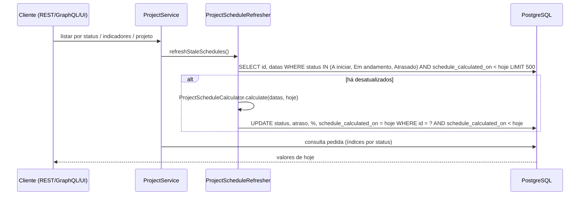

# ADR 0002 — Status, dias de atraso e % de tempo restante sempre referentes a hoje

- **Status:** Aceito. Implementado no F5-L1.
- **Data:** 2026-09-24
- **Contexto do desafio:** definições de status, "Cálculo — Percentual de tempo restante" e "Cálculo — Dias de atraso". Todas usam "hoje". Etapa 2 pede a listagem por status do Kanban, e a Etapa 3 pede indicadores por status.

## 1. Contexto

Até a v1.0.0, status, dias de atraso e % de tempo restante eram calculados só ao criar, editar ou transicionar um projeto, e depois ficavam gravados. As leituras devolviam o valor gravado, e isso valia para o projeto, a listagem por status, os filtros e os indicadores.

**Consequência:** um projeto Em andamento cujo término previsto passasse continuava Em andamento, com 0 dia de atraso, até alguém editá-lo.

**Efeito na transição:** ela partia do status gravado. Por isso, um projeto desatualizado aceitava Em andamento → Atrasado, que a tabela do desafio manda bloquear.

Um problema menor somava-se a isso: o `Clock` era UTC. Das 21h à meia-noite em Recife, "hoje" já era o dia seguinte.

## 2. Decisão

1. **"Hoje" é a data no fuso de negócio.**
   - O relógio é `Clock.system(ZoneId.of(app.time-zone))`, com `APP_TIME_ZONE` e padrão `America/Sao_Paulo`.
   - Um fuso inválido impede a subida.
   - Os instantes de auditoria (`createdAt`, `updatedAt`) continuam absolutos (`Instant`).
2. **Cada projeto grava a data do último cálculo.** A migration V6 cria `projects.schedule_calculated_on`.
   - Nas linhas existentes, o valor é a data UTC de `updated_at`. É exatamente o "hoje" que a v1.0.0 usou ao gravar.
   - Índice `(status, schedule_calculated_on)`.
3. **Recálculo quando o dia muda.** `ProjectScheduleRefresher` (aplicação, sem Spring) busca, em lotes de 500 ordenados por id, os projetos **não concluídos** com `schedule_calculated_on < hoje`. Para cada um:
   - recalcula com `ProjectScheduleCalculator`;
   - grava status, atraso, % e a data com `UPDATE … WHERE schedule_calculated_on < hoje`.
   - Uma gravação concorrente mais nova prevalece, e repetir o recálculo não muda nada (idempotente).
4. **Quando roda.**
   - No início de `get`, `search` e `indicators`, e portanto também em `update`, `transition` e `delete`, que leem o projeto por `get`.
   - Na subida (`ApplicationReadyEvent`).
   - À meia-noite do fuso de negócio (`@Scheduled`, `APP_SCHEDULE_REFRESH_CRON`).
   - A verificação nas leituras é uma consulta indexada que normalmente não devolve linhas.
   - O agendamento só antecipa o trabalho: se falhar, a próxima leitura corrige.
5. **Projeto concluído não é recalculado.** Com término realizado, o resultado é sempre Concluído, 0 dia e 0%, e não depende de hoje.
6. **Recálculo do sistema não altera `updatedAt`.** `updatedAt` registra a última edição feita pelo usuário (auditoria mínima do desafio). A data do cálculo fica em `schedule_calculated_on`.
7. **A transição parte do status de hoje.** `ProjectStatusTransition` classifica a origem pelas datas e por hoje, e não pelo valor gravado. A regra fica no domínio mesmo que o chamador não tenha recalculado.
8. **Registro inconsistente não derruba a leitura.**
   - Se o cálculo de um projeto lançar exceção, o recálculo registra um aviso com o id e segue com os demais.
   - Isso não deve ocorrer: as mesmas regras validam a gravação, e o banco tem `CHECK` nas datas.

## 3. Alternativas consideradas

| Alternativa | Por que não |
|---|---|
| Calcular status e métricas em SQL a cada consulta (`CASE` com `current_date`) | Duplica a regra em Java e em SQL; o filtro por status deixa de usar índice; a média de atraso vira expressão em toda consulta de indicador. |
| Não gravar os valores e calcular em memória na leitura | Não permite paginar nem filtrar por status no banco; a listagem por status exigiria ler todos os projetos. |
| Só o job da meia-noite | Se a aplicação estiver parada à meia-noite, ou se o job falhar, o dia inteiro fica errado. A verificação na leitura elimina essa janela. |
| Marcar o último recálculo em memória | Não funciona com várias instâncias nem após reinício; o estado no banco funciona. |
| Índice parcial `WHERE status <> 'COMPLETED'` | Com parâmetro de consulta (plano genérico do PostgreSQL), o planejador não prova a condição do índice parcial. O índice composto `(status, schedule_calculated_on)` com `status IN (…)` atende sem depender do plano. |

## 4. Consequências e trade-offs

**Ganhos:**

- Os valores exibidos valem sempre para hoje, em todas as leituras (REST, GraphQL, UI, filtros e indicadores).
- A tabela de transição é aplicada sobre o status real de hoje.
- Continuam a paginação, o filtro por status via índice e os indicadores em SQL.

**Custos:**

- Uma consulta indexada a mais por leitura.
- No primeiro acesso do dia, a leitura paga o recálculo dos desatualizados. O job da meia-noite normalmente já fez esse trabalho.

**Janela de três horas após a migration.**

- Nas linhas gravadas pela v1.0.0 entre 21h e meia-noite de Recife, a data do cálculo é o dia seguinte (UTC). O valor gravado vale para esse dia seguinte.
- Até a meia-noite local, a leitura mostra o valor calculado para o dia seguinte. Depois, tudo converge.
- A correção exata exigiria inventar uma data de cálculo que não aconteceu.

**Várias instâncias:** cada uma pode executar a verificação. As gravações são condicionais e idempotentes, então não há conflito de resultado.

## 5. Testes

| Nível | Teste | O que prova |
|---|---|---|
| Domínio | `ProjectStatusTransitionTest.line05DoesNotLetStaleInProgressBypassTheInProgressToOverdueBlock`, `line05BlocksInProgressToOverdueWhenDatesDoNotRecalculateAsOverdue`, `line02TreatsStaleNotStartedAsOverdueOnceThePlannedStartHasPassed` | a transição parte do status de hoje |
| Aplicação | `ProjectScheduleRefresherTest` (relógio que avança) | Em andamento → Atrasado após 10 dias (8 dias de atraso, 0%); listagem, filtro e indicadores; concluído intocado; idempotência; mais de um lote; fuso |
| Integração | `ScheduleFreshnessIT` (PostgreSQL real) | leitura recalcula; `updatedAt` intacto; `schedule_calculated_on` = hoje; filtros e indicadores |
| Migração | `ScheduleCalculationDateMigrationIT` | V6 sobre banco V1–V5 com dados: preenchimento pela data UTC da última gravação, `NOT NULL` e índice |
| Gate | `docs/evidence/F5-L1/VERIFICACAO-USUARIO.md` | cenário ponta a ponta no Docker com banco novo |
